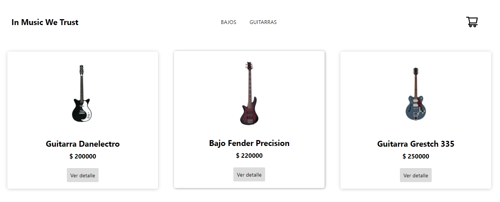

# E - commerce de Instrumentos

Este proyecto se realizó siguiendo un curso de React, donde desarrollamos el flujo de un e-commerce (de rubro a elección). 

## Vista del "Home"



## Librerias que se utilizaron

- [Firebase](https://firebase.google.com/) : Almacenar la información de los productos en una base de datos NoSQL, y tambien guardar los pedidos de los clientes. Además nos provee métodos para poder manipular la data de las promesas y tomar lo que queramos de ellas mas fácilmente.

- [React-Router-Dom](https://reactrouter.com/en/main) : A partir de esta librería definimos las rutas de navegación dentro de la app.

- [React-Spinners](https://www.npmjs.com/package/react-spinners) : Nos provee distintas animaciones de "loaders", muy útiles en los momentos que la app esta procesando información y no muestra nada en pantalla. Hacen a la experiencia de usuario algo mas fluida y satisfacitoria.

## Funcionalidades del proyecto

- Filtrar los productos por categoría.
- Ver el detalle de un producto. Desde esta misma vista se puede agregar el producto al carrito, modificando su cantidad.
- El carrito nos provee una vista mas compacta de los productos que estan en la compra, con su cantidad, precio unitario y opción para eliminar dicho producto del carrito.
- Vaciar el carrito completamente.
- Opción para visualizar el carrito en cualquier instancia de la compra.
- Checkout de compra con formulario, inputs obligatorios y validación de E-mail. Si alguno de los campos esta vacío no se podrá enviar la información, además de que si ambos campos de E-mail no son iguales, el boton "Enviar", queda inhabilitado.
- Al final de la compra, firebase nos otorga un código de seguimiento de la misma.

## Pasos para descargar el proyecto y utilizarlo en local

- Clonar el repositorio

``` 
Git clone
https://github.com/estebanPelutiero/E-commerce-instrumentos-React.git
``` 
- Instalar las dependencias

``` 
npm install
``` 

- Correr el proyecto en el navegador

``` 
npm start
``` 